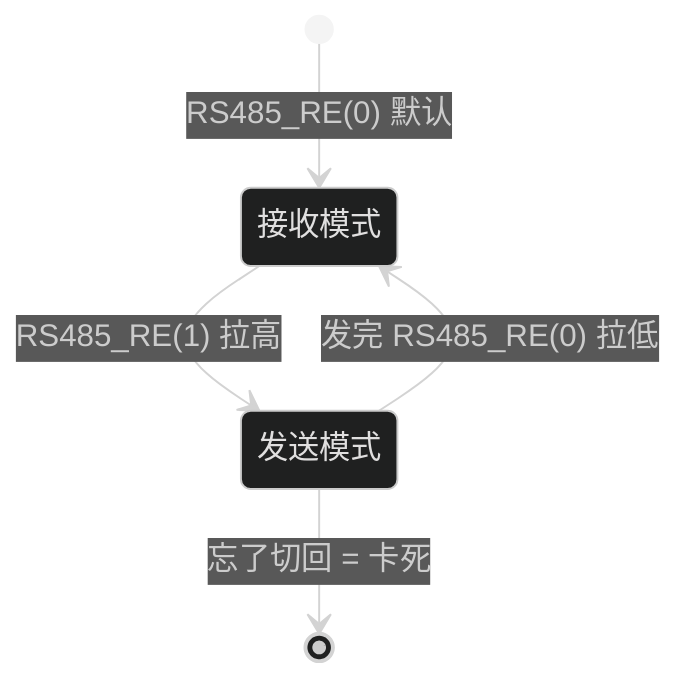
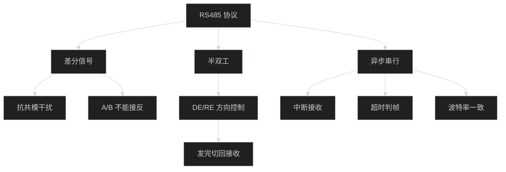

# RS485 协议学习笔记

> 基于正点原子「实验26 485实验」（STM32F407 HAL 库）· 自测整理

---

## 颜色标记图例

| 标记 | 含义 |
|---|---|
| 🔴 | 易错 / 踩坑点（重点避雷） |
| 🟢 | 已掌握 |
| 🟡 | 半掌握 / 需注意 |
| 🔵 | 核心必记 |
| ⭐ | 重点 |

---

## 一、RS485 是什么

- **本质**：一种**差分信号**的串行通信标准，用于远距离、抗干扰、多机通信
- **特点**：🔵 **半双工**、多机（最多 32 节点）、传输远（1200m）、抗干扰强

### 和 UART（串口）的区别

| 对比项 | RS485 | UART |
|---|---|---|
| 双工方式 | 半双工，收发不能同时 | 全双工，可同时收发 |
| 物理线 | A + B 差分双绞线 | TX + RX 单端 |
| 抗干扰 | 差分信号，强 | 单端信号，弱 |
| 距离 | 最长 1200m | 很短（几米） |
| 节点数 | 一对多（32 个） | 一对一 |

---

## 二、核心原理：差分信号

RS485 用 **A、B 两根线**，靠两根线的**电压差**表示逻辑，而不是对地的绝对值：

| A、B 电压关系 | 逻辑 |
|---|---|
| A 比 B 高（差值 > +0.2V） | 逻辑 1 |
| A 比 B 低（差值 < -0.2V） | 逻辑 0 |

**抗干扰原理（抗共模干扰）**：

1. 外部电磁干扰会**同时**叠加到 A、B 两根线上
2. 接收端只关心 `A − B` 的**差值**
3. 两根线涨了同样的干扰 → 做减法时干扰**被抵消**

🔴 **易错**：RS485 的逻辑**不是**「显性 0 / 隐性 1」——那是 **CAN 总线**的术语（线与仲裁机制）。别串！
⭐ 一句话：**485 = 差分电压定 0/1；CAN = 显性/隐性。**

---

## 三、硬件：从 UART 到 485

F407 的 USART 只能输出 **TTL 单端电平**，要变成 485 差分信号，中间靠一颗 **485 收发芯片（SP3485 / TP8485）**：

```
MCU USART2_TX (PA2) ──► DI  ──► SP3485 ──► A / B 差分总线
MCU USART2_RX (PA3) ◄── RO  ◄── SP3485 ◄── A / B 差分总线
```

- **发送方向**：USART 单端 TTL → 芯片转成 A/B 差分
- **接收方向**：A/B 差分 → 芯片转回单端 TTL

🔵 **为什么用 USART2（PA2/PA3）**：这块板把 USART2 接到 485 芯片；而 USART1（PA9/PA10）接的是板载 CH340（USB 转 TTL），负责和电脑串口助手通信。**485 通信口和调试口是两条独立的串口，别混。**

---

## 四、半双工与方向切换（⭐ 整个实验最核心）

### 4.1 为什么是半双工

485 只有**一对 A/B 线**，物理上同一时刻只能一个方向：要么发、要么收。

### 4.2 DE / RE 方向控制脚

| 引脚 | 全称 | 作用 | 有效电平 |
|---|---|---|---|
| DE | Driver Enable | 发送使能 | 高电平 = 能发 |
| RE | Receiver Enable | 接收使能 | 低电平 = 能收 |

开发板把 DE、RE 接在一起，用 GPIO（**PG8**）统一控制：

- `RS485_RE(1)` = PG8 拉高 = 🔵 **发送态**
- `RS485_RE(0)` = PG8 拉低 = 🔵 **接收态**（默认）

### 4.3 方向切换时序

```c
void rs485_send_data(uint8_t *buf, uint8_t len) {
    RS485_RE(1);                          // ① 先切"发送"
    HAL_UART_Transmit(&g_rs485_handler, buf, len, 1000);   // ② 发数据
    RS485_RE(0);                          // ③ 发完立刻切回"接收"
}
```

🟡 **为什么必须这个顺序**：
- 发送前必须进发送态，否则数据出不去
- 发完必须切回接收态，否则芯片一直占着发送，**永远收不到对方回发的数据**

🔴 **踩坑**：`RS485_RE` 这个宏里 `while(1)` 会让程序卡死在"切发送"这一步，后面发送永远执行不到（编译报 `statement is unreachable` 警告）。必须写成 `while(0)`。

---

## 五、波特率

🔵 **收发双方波特率必须一致**。

- 波特率 = 每秒传输的位数
- 接收方按自己的时钟在**位中间**采样
- 两边波特率不同 → 采样点错位 → 读到的位组合全乱 → 收到**乱码**

🟡 实验里 485 用 `rs485_init(9600)`；而调试串口 USART1 用 115200。两者独立，别搞混。

---

## 六、接线极性

🔵 **A 接 A、B 接 B，不能接反**。

🔴 **接反了会发生什么（易错！不是"收发顺序反"）**：
- 接反 → 差分**极性反转**
- 本来"A 比 B 高 = 逻辑 1"，接反后变成"B 比 A 高 = 逻辑 1"
- 结果：**所有 0 变 1、1 变 0**，收到的数据整体翻转、全错

⭐ 本质是**逻辑反相**，跟收发方向没关系。

---

## 七、接收机制：中断驱动

🔵 **发送是"主动"的，接收是"被动"的**——主循环并没有在读串口，数据是**中断驱动**进来的。

### 完整过程（对方发 1 字节 → 本机主循环拿到）

1. 对方发出字节 → 它的 485 芯片转成 A/B 差分信号
2. 你的 485 芯片收到差分信号，转回 TTL
3. 你的 USART2 硬件收满完整 1 字节 → 硬件自动置位 RXNE 标志 → 触发 USART2 中断
4. CPU 暂停主循环，跳进 `USART2_IRQHandler`（代码里叫 `RS485_UX_IRQHandler`）
5. 中断函数把这一字节读走，存进 `g_RS485_rx_buf`，计数 `g_RS485_rx_cnt++`
6. 主循环过后用 `rs485_receive_data` 把缓冲区数据拷出来

```c
void RS485_UX_IRQHandler(void) {          // 即 USART2_IRQHandler
    if (__HAL_UART_GET_FLAG(&g_rs485_handler, UART_FLAG_RXNE)) {
        HAL_UART_Receive(&g_rs485_handler, &res, 1, 1000);
        if (g_RS485_rx_cnt < RS485_REC_LEN)
            g_RS485_rx_buf[g_RS485_rx_cnt++] = res;   // 存缓冲区、计数+1
    }
}
```

⭐ 发 5 字节就进 5 次中断，数据被逐个"捡"进缓冲区，主循环完全不用管接收时机。

---

## 八、帧结束判定

🔵 串口数据是**一个字节一个字节**到的，没有"帧结束"标志。怎么知道一帧收完了？

**答案：超时判定（10ms 无新数据 = 帧结束）**

```c
void rs485_receive_data(uint8_t *buf, uint8_t *len) {
    uint8_t rxlen = g_RS485_rx_cnt;   // ① 记下当前计数
    *len = 0;
    delay_ms(10);                     // ② 等 10ms
    if (rxlen == g_RS485_rx_cnt && rxlen) {   // ③ 计数没变且 >0 → 一帧结束
        // 拷出数据、写回长度、清零计数
    }
}
```

🟡 这个 `delay_ms(10)` 就是关键：**10ms 内没再收到新字节，就认为这一帧发完了**。这是 485/UART 变长帧最常用的判定技巧。

---

## 九、多机通信（综合）

一条 485 总线挂 3 台设备互相通信，至少解决：

1. 🔵 **设备地址/寻址**：总线是广播的，一台发、所有都能收到。每个设备要有唯一地址，收到后判断"是不是发给我的"。
2. 🔵 **总线竞争/仲裁**：同一时刻只能一台发。要有机制避免两台同时抢总线（常见做法："一主多从"轮询，主机点名、从机才回）。
3. 🔵 **方向切换**：每台设备都要正确切换 DE/RE，发完立刻切回接收，别占着总线。
4. 其他：波特率全部一致、长线两端加 120Ω 终端电阻。

---

## 十、逻辑框图

### 图 1：一个数据包从 A 板到 B 板的完整旅程


### 图 2：方向切换状态机



### 图 3：RS485 概念关系图



---

## 十一、十道自测题 + 答案解析

### 第 1 题 · 差分信号 🔴 理解错（混淆 CAN）

**题**：RS485 靠什么区分逻辑 0 和 1？为什么比 UART 抗干扰强？

**答**：A/B 两根线靠**电压差**区分（A−B 为正 = 1，为负 = 0）。抗干扰强是因为干扰同时叠加到 A、B，做减法被抵消。

🔴 你答成"显性 0 隐性 1"，那是 **CAN** 的术语，不是 485。

### 第 2 题 · 双工方式 🟢 正确

**题**：RS485 全双工还是半双工？带来什么限制？

**答**：半双工，收发不能同时（因为共用一对 A/B 线）。

### 第 3 题 · 方向控制脚 🔴 未掌握（要会）

**题**：DE 和 RE 分别起什么作用？

**答**：
- DE = Driver Enable（发送使能），高电平能发
- RE = Receiver Enable（接收使能），低电平能收

开发板把两者接一起用 PG8 统一控制。

### 第 4 题 · 方向切换时序 🟡 顺序对、原因不会

**题**：`rs485_send_data` 的执行顺序？为什么必须这个顺序？

**答**：①切发送 → ②发数据 → ③切回接收。
原因：半双工，发送前必须进发送态；发完必须切回接收态，否则永远收不到对方数据。

### 第 5 题 · 波特率 🟢 基本对

**题**：波特率不一致会发生什么？

**答**：采样点错位，收到乱码，无法正常通信。

### 第 6 题 · 接线极性 🔴 理解错

**题**：A/B 接反会怎样？

**答**：不是"收发顺序反"，而是**差分极性反转 → 逻辑 0/1 全部反相 → 数据全错**。

🔴 你答成"改变收发顺序"，是理解错了。

### 第 7 题 · 中断接收 🔴 未掌握（核心机制）

**题**：主循环没读串口，数据怎么进来的？

**答**：中断驱动。USART2 收满 1 字节 → RXNE 标志置位 → 触发中断 → 中断函数读走存入 `g_RS485_rx_buf`、计数+1 → 主循环再用 `rs485_receive_data` 拷出。

### 第 8 题 · 帧结束判定 🔴 未掌握

**题**：程序怎么判断"一帧收完了"？

**答**：超时判定。记下计数 → `delay_ms(10)` → 计数没变且 >0，就认为一帧结束。

### 第 9 题 · 电平转换 🟢 基本对

**题**：TTL 怎么变成差分信号？

**答**：靠 485 收发芯片（SP3485/TP8485）做转换：发时单端→差分，收时差分→单端。

### 第 10 题 · 多机通信 🔴 未掌握

**题**：3 台设备挂一条总线，要解决什么问题？

**答**：①设备地址寻址 ②总线竞争/仲裁 ③方向切换 ④波特率一致 + 终端电阻。

---

## 十二、掌握程度总结

| 掌握程度 | 题目 |
|---|---|
| 🟢 会了 | 2（半双工）、5（波特率）、9（电平转换） |
| 🟡 半会 | 1（混淆 CAN）、4（顺序对、原因不会） |
| 🔴 不会/理解错 | 3（DE/RE）、6（AB 接反）、7（中断接收）、8（帧结束判定）、10（多机） |

⭐ **最该补的三块**：DE/RE 方向控制（第 3 题）、中断接收（第 7 题）、超时判帧（第 8 题）——这三个是你 `rs485.c` 代码里天天用到的东西。

---

## 十三、易错点清单（编译/调试时踩过的坑）

- 🔴 `RS485_RE` 宏写成 `while(1)` 导致死循环，必须 `while(0)`
- 🔴 `HAL_UART_Receive` 是 4 个参数，不是 5 个
- 🔴 宏名是 `__HAL_UART_DISABLE_IT`（带 `_IT`），不是 `__HAL_UART_DISABLE`
- 🔴 `rs485_receive_data` 第二参数是 `uint8_t *` 指针（传 `&key`），不是值
- 🔴 `key_scan()` 必须带参数 `key_scan(0)`
- 🔴 `usmart_dev.init(84)` 是**点号**，不是 `usmart_dev_init`（下划线）
- 🟡 HAL 库缺源文件会报 `Undefined symbol`，要补 `stm32f4xx_hal_sram.c`、`stm32f4xx_hal_tim.c`、`stm32f4xx_hal_tim_ex.c`、`stm32f4xx_ll_fsmc.c`
- 🔴 中断接收里 `g_RS485_rx_cnt++` 别写两遍（`buf[cnt++] = res` 已经自增了）
